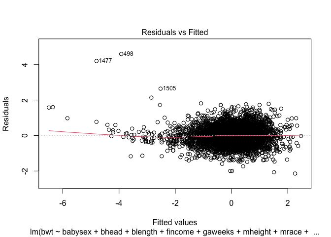
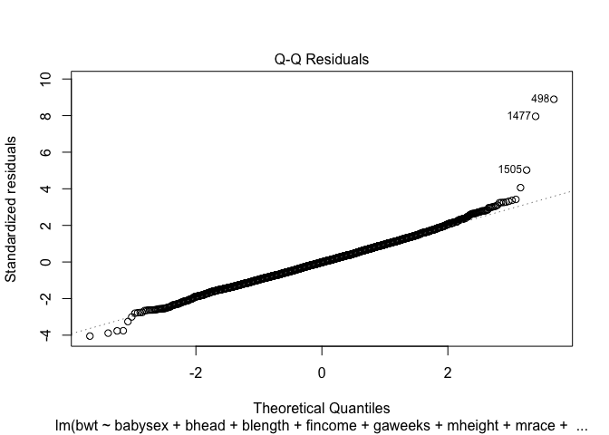
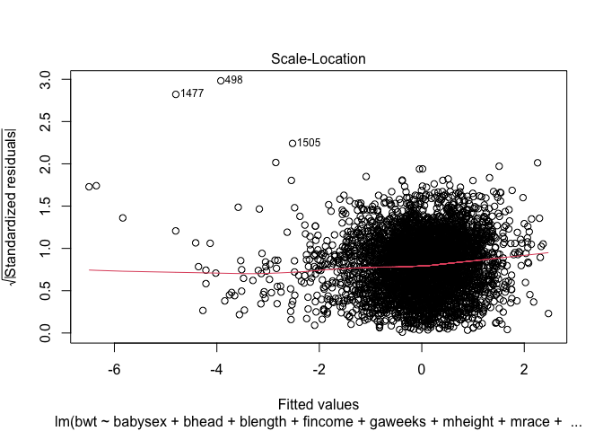
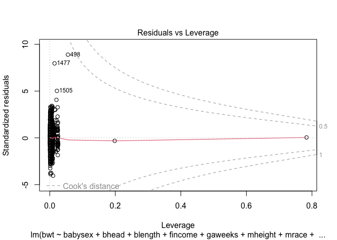
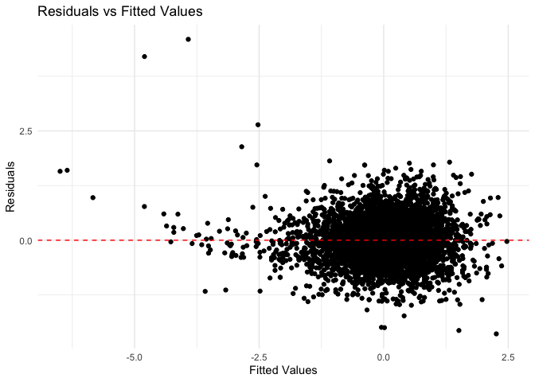

p8105_hw6_yq2378
================
Qi Yumeng
2023-12-01

``` r
set.seed(1)
x = c("tidyverse","ggpubr","modelr","dplyr","MASS","corrplot","mgcv")
lapply(x, require, character.only = TRUE)
```

    ## Loading required package: tidyverse

    ## ── Attaching core tidyverse packages ──────────────────────── tidyverse 2.0.0 ──
    ## ✔ dplyr     1.1.3     ✔ readr     2.1.4
    ## ✔ forcats   1.0.0     ✔ stringr   1.5.0
    ## ✔ ggplot2   3.4.4     ✔ tibble    3.2.1
    ## ✔ lubridate 1.9.3     ✔ tidyr     1.3.0
    ## ✔ purrr     1.0.2     
    ## ── Conflicts ────────────────────────────────────────── tidyverse_conflicts() ──
    ## ✖ dplyr::filter() masks stats::filter()
    ## ✖ dplyr::lag()    masks stats::lag()
    ## ℹ Use the conflicted package (<http://conflicted.r-lib.org/>) to force all conflicts to become errors
    ## Loading required package: ggpubr
    ## 
    ## Loading required package: modelr
    ## 
    ## Loading required package: MASS
    ## 
    ## 
    ## Attaching package: 'MASS'
    ## 
    ## 
    ## The following object is masked from 'package:dplyr':
    ## 
    ##     select
    ## 
    ## 
    ## Loading required package: corrplot
    ## 
    ## corrplot 0.92 loaded
    ## 
    ## Loading required package: mgcv
    ## 
    ## Loading required package: nlme
    ## 
    ## 
    ## Attaching package: 'nlme'
    ## 
    ## 
    ## The following object is masked from 'package:dplyr':
    ## 
    ##     collapse
    ## 
    ## 
    ## This is mgcv 1.9-0. For overview type 'help("mgcv-package")'.

    ## [[1]]
    ## [1] TRUE
    ## 
    ## [[2]]
    ## [1] TRUE
    ## 
    ## [[3]]
    ## [1] TRUE
    ## 
    ## [[4]]
    ## [1] TRUE
    ## 
    ## [[5]]
    ## [1] TRUE
    ## 
    ## [[6]]
    ## [1] TRUE
    ## 
    ## [[7]]
    ## [1] TRUE

# Problem 1

``` r
homicide = read.csv("https://raw.githubusercontent.com/washingtonpost/data-homicides/master/homicide-data.csv")

homicide = homicide |>
  mutate(city_state = str_c(city, state, sep=", "),
         if_solved = if_else(disposition == "Closed by arrest",1,0 ),
         victim_age = as.numeric(victim_age)) |>
  filter(!(city_state %in% c('Dallas, TX', 'Phoenix, AZ', 'Kansas City, MO','Tulsa, AL'))) |>
  filter(victim_race %in% c("White", "Black"),
         !is.na(victim_age),
         victim_sex %in% c("Female", "Male")) # delete non-numeric, missing age and Unknown sex
```

    ## Warning: There was 1 warning in `mutate()`.
    ## ℹ In argument: `victim_age = as.numeric(victim_age)`.
    ## Caused by warning:
    ## ! NAs introduced by coercion

``` r
# Function to fit logistic regression and extract OR and CI
fit_logistic = function(data) {
  glm_res = glm(if_solved ~ victim_age + victim_sex + victim_race, data = data, family = "binomial")
  tidy_res = broom::tidy(glm_res, exponentiate = TRUE, conf.int = TRUE)
  or_ci = tidy_res |>
    filter(term == "victim_sexMale") |>
    dplyr::select(estimate, conf.low, conf.high)
  return(or_ci)
}
```

``` r
# Fit logistic regression for Baltimore, MD
homicide |>
  filter(city_state == "Baltimore, MD") |>
  fit_logistic()
```

    ## # A tibble: 1 × 3
    ##   estimate conf.low conf.high
    ##      <dbl>    <dbl>     <dbl>
    ## 1    0.426    0.324     0.558

``` r
# Fit logistic regression for each city and extract OR and CI
city_results = homicide |>
  group_by(city_state) |>
  nest() |>
  mutate(or_ci = map(data, fit_logistic)) |>
  unnest(or_ci) |>
  dplyr:: select(-data) |>
  rename(OR = estimate, CI_low = conf.low, CI_high = conf.high) |>
  arrange(desc(OR))
```

``` r
ggplot(city_results, aes(x = reorder(city_state, OR),
                         y = OR, ymin = CI_low, ymax = CI_high)) +
  geom_point(position = position_dodge(width = 0.5), size = 1, color = "red") +
  geom_errorbar(position = position_dodge(width = 0.5), width = 0.2) +
  geom_hline(yintercept = 1, color = "blue", linetype = 2) +
  labs(title = "Estimated ORs and CIs for Solving Homicides (Male vs. Female)",
       x = "City",
       y = "Odds Ratio") +
  theme_pubclean() +
  theme(axis.text.x = element_text(angle = 45, hjust = 1))
```


The plot provides a visual representation of the estimated odds ratios
(ORs) and their corresponding confidence intervals (CIs) for 47 cities.
Notably, New York, NY exhibits the smallest OR, while Albuquerque, NM
boasts the largest.

Beginning with Atlanta, GA, a distinct trend emerges: the subsequent six
cities exhibit ORs greater than 1. This implies that in these particular
cities, homicide cases involving male victims are more likely to be
resolved compared to those involving female victims. On the contrary,
the remaining 41 cities in the dataset exhibit an inverse relationship,
signifying that homicides with female victims tend to have higher odds
of resolution.

Regarding the error bars in the plot, it’s notable that the cities
positioned towards the right side generally exhibit wider error bars.
This observation suggests a potential issue related to sample size in
these cities. Wider error bars typically indicate increased uncertainty
in the estimated odds ratios, and this could be attributed to smaller
sample sizes for certain cities.

# Problem 2

``` r
weather = 
  rnoaa::meteo_pull_monitors(
    c("USW00094728"),
    var = c("PRCP", "TMIN", "TMAX"), 
    date_min = "2022-01-01",
    date_max = "2022-12-31") |>
  mutate(
    name = recode(id, USW00094728 = "CentralPark_NY"),
    tmin = tmin / 10,
    tmax = tmax / 10) |>
  dplyr::select(name, id, everything())
```

    ## using cached file: /Users/luchen/Library/Caches/org.R-project.R/R/rnoaa/noaa_ghcnd/USW00094728.dly

    ## date created (size, mb): 2023-12-01 11:24:03.114447 (8.544)

    ## file min/max dates: 1869-01-01 / 2023-11-30

### $\log \left(\hat{\beta}_1 \times \hat{\beta}_2\right)$ Distribution

This distribution has a heavy tail extending to low values and a bit of
a “shoulder”. The density plog of
$\log \left(\hat{\beta}_1 \times \hat{\beta}_2\right)$ values represents
the variability in the logarithmic product of the estimated coefficients
for `tmin` and `prxp` in the linear regression model. The value centers
around -6. This quantity captures the joint effect of the predictors on
`tmax`. The spread provides insights into the uncertainty associated
with this combined predictor influence.

``` r
# prepocessing? 

beta = 
  weather |> 
  modelr::bootstrap(n = 5000) |> 
  mutate(
    models = map(strap, \(df) lm(tmax ~ tmin + prcp, data = df)),
    results = map(models, broom::tidy)) |> 
  dplyr::select(.id,results) |> 
  unnest(results) |> 
  filter(term %in% c('tmin', 'prcp')) |>
  group_by(.id) |>
  summarise(estimate = log(prod(estimate))) 
```

    ## Warning: There were 3361 warnings in `summarise()`.
    ## The first warning was:
    ## ℹ In argument: `estimate = log(prod(estimate))`.
    ## ℹ In group 2: `.id = "0002"`.
    ## Caused by warning in `log()`:
    ## ! NaNs produced
    ## ℹ Run `dplyr::last_dplyr_warnings()` to see the 3360 remaining warnings.

``` r
CI_beta_squared = quantile(beta$estimate, c(0.025, 0.975),na.rm = TRUE)
ggplot(beta,aes(x = estimate)) + geom_density() + theme_pubclean() + 
  labs(title = "Distribution of log(beta1 * beta2)", x = "log(beta1 * beta2)",
       subtitle = paste("95% CI for R-squared: ","(", round(CI_beta_squared[1],2),", ", round(CI_beta_squared[2],2),")", sep ="")) 
```

    ## Warning: Removed 3361 rows containing non-finite values (`stat_density()`).


### $R^2$ Distribution

The distribution of $R^2$ values reflects the variability in how well
the linear regression model explains the variance in the maximum
temperature. The density plot shows a range of $R^2$ values obtained
from 5000 bootstrap samples. It is roughly bell shape. Higher $R^2$
values indicate a better fit of the model, while lower values suggest
less explanatory power. The distribution helps us understand the
uncertainty in estimating the goodness-of-fit for the given predictors
(`tmin` and `prcp`). The most frequent values range from 0.91 to 0.93,
which is a pretty good fit.

``` r
# prepocessing? 
R2 = 
  weather |> 
  modelr::bootstrap(n = 5000) |> 
  mutate(
    models = map(strap, \(df) lm(tmax ~ tmin + prcp, data = df)),
    results = map(models, broom::glance)) |> 
  dplyr::select(results) |> 
  unnest(results) |>
  dplyr::select(r.squared) 

CI_r_squared = quantile(R2$r.squared, c(0.025, 0.975))
ggplot(R2,aes(x = r.squared)) + geom_density() + theme_pubclean() + 
  labs(title = "Distribution of R-squared", x = "R-squared",
       subtitle = paste("95% CI for R-squared: ","(", round(CI_r_squared[1],2),", ", round(CI_r_squared[2],2),")", sep ="")) 
```


# Problem 3

``` r
variable_factor = c(
  babysex = "factor", 
  frace = "factor",         
  malform = "factor",
  mrace = "factor")

birthweight = read.csv("https://p8105.com/data/birthweight.csv"
                       ,colClasses = variable_factor)
birthweight = birthweight  |> janitor::clean_names()
skimr::skim(birthweight)
```

|                                                  |             |
|:-------------------------------------------------|:------------|
| Name                                             | birthweight |
| Number of rows                                   | 4342        |
| Number of columns                                | 20          |
| \_\_\_\_\_\_\_\_\_\_\_\_\_\_\_\_\_\_\_\_\_\_\_   |             |
| Column type frequency:                           |             |
| factor                                           | 4           |
| numeric                                          | 16          |
| \_\_\_\_\_\_\_\_\_\_\_\_\_\_\_\_\_\_\_\_\_\_\_\_ |             |
| Group variables                                  | None        |

Data summary

**Variable type: factor**

| skim_variable | n_missing | complete_rate | ordered | n_unique | top_counts                      |
|:--------------|----------:|--------------:|:--------|---------:|:--------------------------------|
| babysex       |         0 |             1 | FALSE   |        2 | 1: 2230, 2: 2112                |
| frace         |         0 |             1 | FALSE   |        5 | 1: 2123, 2: 1911, 4: 248, 3: 46 |
| malform       |         0 |             1 | FALSE   |        2 | 0: 4327, 1: 15                  |
| mrace         |         0 |             1 | FALSE   |        4 | 1: 2147, 2: 1909, 4: 243, 3: 43 |

**Variable type: numeric**

| skim_variable | n_missing | complete_rate |    mean |     sd |     p0 |     p25 |     p50 |     p75 |   p100 | hist  |
|:--------------|----------:|--------------:|--------:|-------:|-------:|--------:|--------:|--------:|-------:|:------|
| bhead         |         0 |             1 |   33.65 |   1.62 |  21.00 |   33.00 |   34.00 |   35.00 |   41.0 | ▁▁▆▇▁ |
| blength       |         0 |             1 |   49.75 |   2.72 |  20.00 |   48.00 |   50.00 |   51.00 |   63.0 | ▁▁▁▇▁ |
| bwt           |         0 |             1 | 3114.40 | 512.15 | 595.00 | 2807.00 | 3132.50 | 3459.00 | 4791.0 | ▁▁▇▇▁ |
| delwt         |         0 |             1 |  145.57 |  22.21 |  86.00 |  131.00 |  143.00 |  157.00 |  334.0 | ▅▇▁▁▁ |
| fincome       |         0 |             1 |   44.11 |  25.98 |   0.00 |   25.00 |   35.00 |   65.00 |   96.0 | ▃▇▅▂▃ |
| gaweeks       |         0 |             1 |   39.43 |   3.15 |  17.70 |   38.30 |   39.90 |   41.10 |   51.3 | ▁▁▂▇▁ |
| menarche      |         0 |             1 |   12.51 |   1.48 |   0.00 |   12.00 |   12.00 |   13.00 |   19.0 | ▁▁▂▇▁ |
| mheight       |         0 |             1 |   63.49 |   2.66 |  48.00 |   62.00 |   63.00 |   65.00 |   77.0 | ▁▁▇▂▁ |
| momage        |         0 |             1 |   20.30 |   3.88 |  12.00 |   18.00 |   20.00 |   22.00 |   44.0 | ▅▇▂▁▁ |
| parity        |         0 |             1 |    0.00 |   0.10 |   0.00 |    0.00 |    0.00 |    0.00 |    6.0 | ▇▁▁▁▁ |
| pnumlbw       |         0 |             1 |    0.00 |   0.00 |   0.00 |    0.00 |    0.00 |    0.00 |    0.0 | ▁▁▇▁▁ |
| pnumsga       |         0 |             1 |    0.00 |   0.00 |   0.00 |    0.00 |    0.00 |    0.00 |    0.0 | ▁▁▇▁▁ |
| ppbmi         |         0 |             1 |   21.57 |   3.18 |  13.07 |   19.53 |   21.03 |   22.91 |   46.1 | ▃▇▁▁▁ |
| ppwt          |         0 |             1 |  123.49 |  20.16 |  70.00 |  110.00 |  120.00 |  134.00 |  287.0 | ▅▇▁▁▁ |
| smoken        |         0 |             1 |    4.15 |   7.41 |   0.00 |    0.00 |    0.00 |    5.00 |   60.0 | ▇▁▁▁▁ |
| wtgain        |         0 |             1 |   22.08 |  10.94 | -46.00 |   15.00 |   22.00 |   28.00 |   89.0 | ▁▁▇▁▁ |

``` r
# delet pnumlbw and pnumsga
```

There are 4342 observation of 20 variables with no missing value. 4
factors and 16 continuous variables. We delete `pnumlbw` and `pnumsga`
for they are all zeros. Next, we standardizaed all the continuous
variables. Standardization involves subtracting the mean and dividing by
the standard deviation, ensuring that all variables are on a comparable
scale. From the correlation plot, we found that some pairs have a
correlation higher than 0.8 which may lead to multicollinearity. To
avoid this, we remove `ppbmi` and `delwt` leaving only `ppwt`.

``` r
# Center non-factor variables
birthweight_scale = birthweight |>
  dplyr::select(-pnumlbw, -pnumsga) |>
  mutate_if(is.numeric, scale)
corrplot(cor(birthweight_scale |> select_if(is.numeric)),  method = "number")
```


``` r
# ppbmi & ppwt 0.85
# ppwt & delwt 0.87

birthweight_scale = birthweight_scale |>
  dplyr::select(-ppbmi, -delwt) 
```

``` r
fit = lm(bwt~., data = birthweight_scale)
stepAIC(fit, direction="both")
```

    ## Start:  AIC=-5460.31
    ## bwt ~ babysex + bhead + blength + fincome + frace + gaweeks + 
    ##     malform + menarche + mheight + momage + mrace + parity + 
    ##     ppwt + smoken + wtgain
    ## 
    ##            Df Sum of Sq    RSS     AIC
    ## - frace     4      0.48 1223.2 -5466.6
    ## - malform   1      0.01 1222.8 -5462.3
    ## - momage    1      0.11 1222.9 -5461.9
    ## - menarche  1      0.43 1223.2 -5460.8
    ## <none>                  1222.8 -5460.3
    ## - fincome   1      0.74 1223.5 -5459.7
    ## - parity    1      1.57 1224.3 -5456.7
    ## - mrace     3      3.32 1226.1 -5454.5
    ## - babysex   1      3.25 1226.0 -5450.8
    ## - mheight   1      4.06 1226.8 -5447.9
    ## - ppwt      1      9.67 1232.4 -5428.1
    ## - gaweeks   1     17.57 1240.3 -5400.4
    ## - smoken    1     19.37 1242.1 -5394.1
    ## - wtgain    1     30.52 1253.3 -5355.3
    ## - blength   1    389.09 1611.8 -4262.7
    ## - bhead     1    406.70 1629.5 -4215.5
    ## 
    ## Step:  AIC=-5466.62
    ## bwt ~ babysex + bhead + blength + fincome + gaweeks + malform + 
    ##     menarche + mheight + momage + mrace + parity + ppwt + smoken + 
    ##     wtgain
    ## 
    ##            Df Sum of Sq    RSS     AIC
    ## - malform   1      0.01 1223.2 -5468.6
    ## - momage    1      0.11 1223.3 -5468.2
    ## - menarche  1      0.45 1223.7 -5467.0
    ## <none>                  1223.2 -5466.6
    ## - fincome   1      0.75 1224.0 -5466.0
    ## - parity    1      1.58 1224.8 -5463.0
    ## + frace     4      0.48 1222.8 -5460.3
    ## - babysex   1      3.24 1226.5 -5457.1
    ## - mheight   1      4.12 1227.3 -5454.0
    ## - ppwt      1      9.69 1232.9 -5434.4
    ## - gaweeks   1     17.62 1240.8 -5406.5
    ## - smoken    1     19.22 1242.5 -5400.9
    ## - wtgain    1     30.53 1253.8 -5361.6
    ## - mrace     3     51.61 1274.8 -5293.2
    ## - blength   1    388.88 1612.1 -4270.0
    ## - bhead     1    407.20 1630.4 -4220.9
    ## 
    ## Step:  AIC=-5468.6
    ## bwt ~ babysex + bhead + blength + fincome + gaweeks + menarche + 
    ##     mheight + momage + mrace + parity + ppwt + smoken + wtgain
    ## 
    ##            Df Sum of Sq    RSS     AIC
    ## - momage    1      0.11 1223.3 -5470.2
    ## - menarche  1      0.45 1223.7 -5469.0
    ## <none>                  1223.2 -5468.6
    ## - fincome   1      0.74 1224.0 -5468.0
    ## + malform   1      0.01 1223.2 -5466.6
    ## - parity    1      1.57 1224.8 -5465.0
    ## + frace     4      0.48 1222.8 -5462.3
    ## - babysex   1      3.24 1226.5 -5459.1
    ## - mheight   1      4.11 1227.3 -5456.0
    ## - ppwt      1      9.69 1232.9 -5436.3
    ## - gaweeks   1     17.62 1240.9 -5408.5
    ## - smoken    1     19.21 1242.5 -5402.9
    ## - wtgain    1     30.59 1253.8 -5363.3
    ## - mrace     3     51.66 1274.9 -5295.0
    ## - blength   1    388.94 1612.2 -4271.8
    ## - bhead     1    407.25 1630.5 -4222.8
    ## 
    ## Step:  AIC=-5470.2
    ## bwt ~ babysex + bhead + blength + fincome + gaweeks + menarche + 
    ##     mheight + mrace + parity + ppwt + smoken + wtgain
    ## 
    ##            Df Sum of Sq    RSS     AIC
    ## - menarche  1      0.38 1223.7 -5470.8
    ## <none>                  1223.3 -5470.2
    ## - fincome   1      0.92 1224.3 -5468.9
    ## + momage    1      0.11 1223.2 -5468.6
    ## + malform   1      0.01 1223.3 -5468.2
    ## - parity    1      1.64 1225.0 -5466.4
    ## + frace     4      0.48 1222.9 -5463.9
    ## - babysex   1      3.21 1226.5 -5460.8
    ## - mheight   1      4.10 1227.5 -5457.7
    ## - ppwt      1     10.19 1233.5 -5436.2
    ## - gaweeks   1     17.83 1241.2 -5409.4
    ## - smoken    1     19.23 1242.6 -5404.5
    ## - wtgain    1     30.50 1253.8 -5365.3
    ## - mrace     3     55.92 1279.3 -5282.1
    ## - blength   1    388.83 1612.2 -4273.8
    ## - bhead     1    407.41 1630.8 -4224.1
    ## 
    ## Step:  AIC=-5470.85
    ## bwt ~ babysex + bhead + blength + fincome + gaweeks + mheight + 
    ##     mrace + parity + ppwt + smoken + wtgain
    ## 
    ##            Df Sum of Sq    RSS     AIC
    ## <none>                  1223.7 -5470.8
    ## + menarche  1      0.38 1223.3 -5470.2
    ## - fincome   1      0.94 1224.7 -5469.5
    ## + momage    1      0.04 1223.7 -5469.0
    ## + malform   1      0.01 1223.7 -5468.9
    ## - parity    1      1.61 1225.3 -5467.1
    ## + frace     4      0.49 1223.2 -5464.6
    ## - babysex   1      3.23 1227.0 -5461.4
    ## - mheight   1      3.86 1227.6 -5459.2
    ## - ppwt      1     10.77 1234.5 -5434.8
    ## - gaweeks   1     17.78 1241.5 -5410.2
    ## - smoken    1     19.34 1243.1 -5404.8
    ## - wtgain    1     31.02 1254.8 -5364.1
    ## - mrace     3     55.98 1279.7 -5282.6
    ## - blength   1    389.60 1613.3 -4272.7
    ## - bhead     1    407.09 1630.8 -4225.9

    ## 
    ## Call:
    ## lm(formula = bwt ~ babysex + bhead + blength + fincome + gaweeks + 
    ##     mheight + mrace + parity + ppwt + smoken + wtgain, data = birthweight_scale)
    ## 
    ## Coefficients:
    ## (Intercept)     babysex2        bhead      blength      fincome      gaweeks  
    ##     0.10447      0.05576      0.41381      0.39853      0.01613      0.07140  
    ##     mheight       mrace2       mrace3       mrace4       parity         ppwt  
    ##     0.03420     -0.27100     -0.14622     -0.19658      0.01935      0.05634  
    ##      smoken       wtgain  
    ##    -0.07005      0.08776

``` r
fit_AIC = lm(bwt~babysex + bhead + blength + fincome + gaweeks + mheight + 
    mrace + parity + ppwt + smoken + wtgain, data = birthweight_scale)
summary(fit_AIC)
```

    ## 
    ## Call:
    ## lm(formula = bwt ~ babysex + bhead + blength + fincome + gaweeks + 
    ##     mheight + mrace + parity + ppwt + smoken + wtgain, data = birthweight_scale)
    ## 
    ## Residuals:
    ##     Min      1Q  Median      3Q     Max 
    ## -2.1423 -0.3622 -0.0066  0.3400  4.5952 
    ## 
    ## Coefficients:
    ##              Estimate Std. Error t value Pr(>|t|)    
    ## (Intercept)  0.104473   0.014835   7.042 2.19e-12 ***
    ## babysex2     0.055761   0.016508   3.378 0.000737 ***
    ## bhead        0.413811   0.010906  37.944  < 2e-16 ***
    ## blength      0.398535   0.010736  37.120  < 2e-16 ***
    ## fincome      0.016130   0.008863   1.820 0.068844 .  
    ## gaweeks      0.071402   0.009005   7.929 2.79e-15 ***
    ## mheight      0.034202   0.009258   3.694 0.000223 ***
    ## mrace2      -0.270998   0.019344 -14.009  < 2e-16 ***
    ## mrace3      -0.146219   0.082621  -1.770 0.076837 .  
    ## mrace4      -0.196578   0.037732  -5.210 1.98e-07 ***
    ## parity       0.019352   0.008105   2.388 0.017004 *  
    ## ppwt         0.056338   0.009129   6.171 7.40e-10 ***
    ## smoken      -0.070053   0.008469  -8.271  < 2e-16 ***
    ## wtgain       0.087759   0.008378  10.475  < 2e-16 ***
    ## ---
    ## Signif. codes:  0 '***' 0.001 '**' 0.01 '*' 0.05 '.' 0.1 ' ' 1
    ## 
    ## Residual standard error: 0.5317 on 4328 degrees of freedom
    ## Multiple R-squared:  0.7181, Adjusted R-squared:  0.7173 
    ## F-statistic: 848.1 on 13 and 4328 DF,  p-value: < 2.2e-16

``` r
plot(fit_AIC)
```

<!-- --><!-- --><!-- --><!-- -->

``` r
# Plot of model residuals against fitted values
fit_AIC_residuals =  broom::augment(fit_AIC)|>
  add_predictions(fit_AIC) |>
  add_residuals(fit_AIC)

ggplot(fit_AIC_residuals, aes(.fitted, .resid)) +
  geom_point() +
  geom_hline(yintercept = 0, linetype = "dashed", color = "red") +
  labs(title = "Residuals vs Fitted Values",
       x = "Fitted Values",
       y = "Residuals") +
  theme_minimal()
```

<!-- -->

``` r
cv_df =
  crossv_mc(birthweight_scale, 100) |> 
  mutate(
    train = map(train, as_tibble),
    test = map(test, as_tibble))
cv_df = 
  cv_df |> 
  mutate(
    linear_mod  = map(train, \(df) lm(bwt ~ babysex + bhead + blength + fincome + 
                                        gaweeks + mheight + mrace + parity + 
                                        ppwt + smoken + wtgain, data = df)),
    
    alter1_mod = map(train, \(df) lm(bwt ~ blength + gaweeks, data = df)),
    alter2_mod  = map(train, \(df) lm(bwt ~ bhead * gaweeks * babysex,  data = df))) |> 
  mutate(
    rmse_linear = map2(linear_mod, test, \(mod, df) modelr::rmse(model = mod, data = df)),
    rmse_alter1    = map2(alter1_mod, test, \(mod, df) modelr::rmse(model = mod, data = df)),
    rmse_alter2 = map2(alter2_mod, test, \(mod, df) modelr::rmse(model = mod, data = df)))
cv_df |> 
  dplyr::select(starts_with("rmse")) |> 
  pivot_longer(
    everything(),
    names_to = "model", 
    values_to = "rmse",
    names_prefix = "rmse_") |>
  mutate(model = factor(model),
         rmse = as.numeric(rmse)) |> 
  ggplot(aes(x = model, y = rmse)) + geom_violin() + theme_pubclean()
```

<!-- -->
